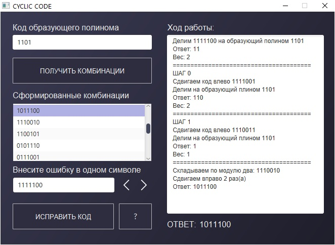

# CyclicCode
### Описание
Программа, демонстрирующая работу циклического кода, что исправляет одиночные ошибки в кодовых комбинациях. Платформа для создания графического интерфейса JavaFx. Шишко А.А. СКС-15 3-й курс.
### Дата
20.12.2017
### Пример работы программы
  
